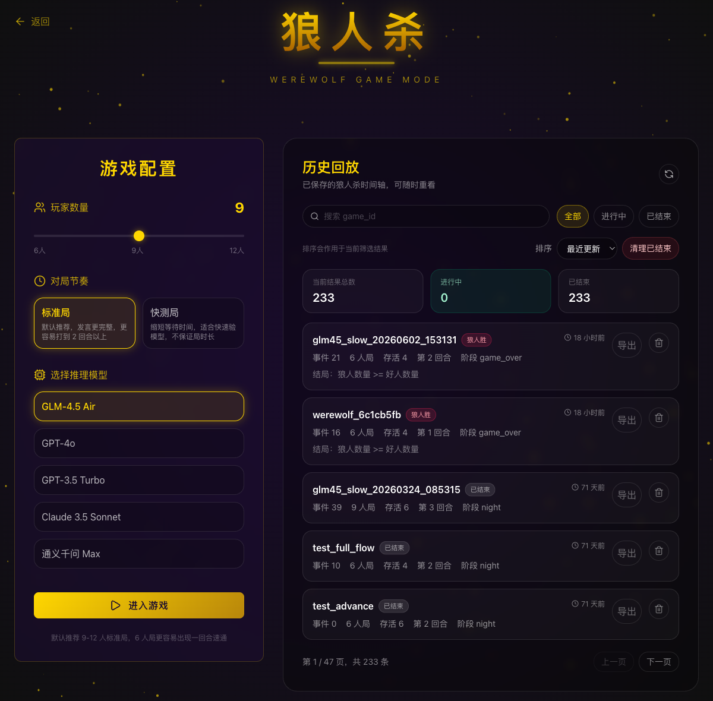
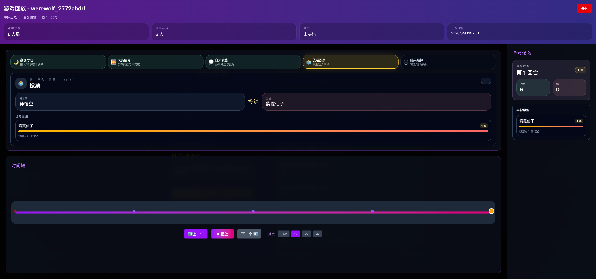
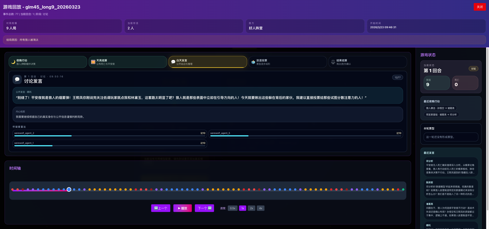

# Mystery Agents

AI agents play social deduction games with live reasoning, replay timelines, and immersive werewolf/undercover gameplay.

Mystery Agents is a local demo sandbox for multi-agent social deduction games. It currently includes Werewolf, Undercover, and discussion-mode experiments, with model configuration, live game events, saved replays, and visual timelines for reviewing how agents reasoned through a match.



## What It Does

- Runs local social deduction game flows backed by configurable LLM providers.
- Supports Werewolf and Undercover-style multi-agent gameplay.
- Shows live phases, speeches, votes, eliminations, and game-over summaries.
- Saves replay timelines for later review and debugging.
- Includes frontend and backend tests for core local-demo workflows.

## Screenshots





## Project Status

This repository is organized as a local demo build, not a production SaaS deployment. It is intended for development, local evaluation, and agent-game experimentation.

Current boundaries:

- No public multi-tenant deployment hardening is claimed.
- Runtime databases, logs, model credentials, and generated state are intentionally ignored by Git.
- Local model/API configuration is required before running real game flows.

## Requirements

- Python 3.10+
- Node.js 18+
- npm

The backend can be run with the system Python/Conda environment or the project virtual environment. The included helper scripts default to a local Python path but can be overridden with `BACKEND_PYTHON`.

## Quick Start

```bash
git clone https://github.com/yyin9116/MysteryAgents.git
cd MysteryAgents
```

Create environment files:

```bash
cp backend/.env.example backend/.env
cp frontend/.env.example frontend/.env
```

Install frontend dependencies:

```bash
cd frontend
npm install
cd ..
```

Start both services:

```bash
./scripts/start.sh
```

Open the app:

- Frontend: `http://localhost:5173`
- Backend API: `http://localhost:8000`
- API docs: `http://localhost:8000/docs`
- Health check: `http://localhost:8000/health`

Stop services:

```bash
./scripts/stop.sh
```

## Manual Development

Run the backend:

```bash
cd backend
cp .env.example .env
python3 main.py
```

Run the frontend:

```bash
cd frontend
cp .env.example .env
npm install
npm run dev
```

If the frontend cannot reach the backend, check `frontend/.env`:

```env
VITE_API_BASE_URL=http://localhost:8000
```

## Testing

Run the local demo validation script:

```bash
./scripts/run_all_tests.sh
```

The script starts the backend, runs the core integration flows, prints a pass/fail summary, and stops the backend.

Frontend checks:

```bash
cd frontend
npm test
npm run build
```

Backend tests:

```bash
cd backend
pytest tests
```

## Repository Map

```text
backend/      FastAPI service, game orchestration, replay storage, model config APIs
frontend/     React/Vite UI for configuration, gameplay, replays, and visual effects
tests/        Cross-module local demo integration checks
scripts/      Local service, validation, and real-game smoke helpers
assets/       README and product assets tracked by Git
```

## Runtime Data And Safety

The following are local runtime artifacts and should not be committed:

- `.env` files and model/API credentials
- SQLite databases such as `undercover_ai.db`
- `game_states/`
- logs, caches, build outputs, and browser automation traces
- `.omx/` and `.playwright-mcp/`

These are covered by `.gitignore` so the repository stays focused on source, tests, and product documentation.

## Troubleshooting

Port already in use:

```bash
lsof -ti:8000
lsof -ti:5173
kill <PID>
```

Backend health check:

```bash
curl http://localhost:8000/health
```

Logs from helper scripts:

```bash
tail -f logs/backend.log
tail -f logs/frontend.log
```

## License

MIT. See [LICENSE](LICENSE).
